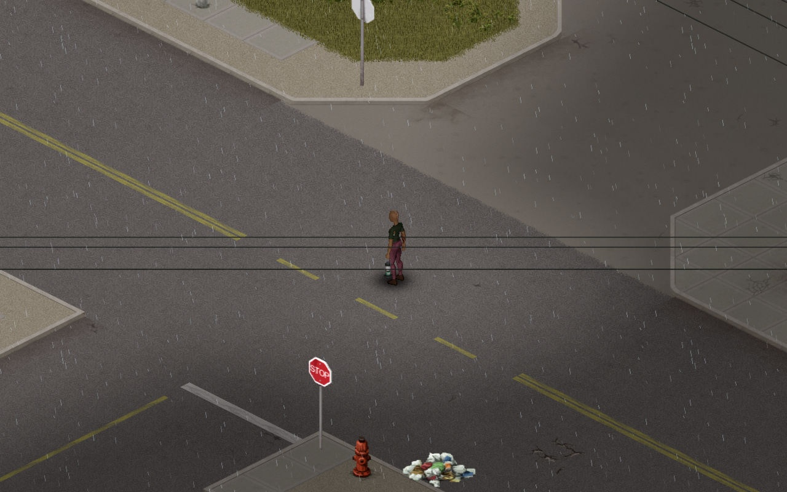

### Files are provided as is, I take no responsibility if something breaks or you get banned on your beloved server, ggs.
### Do not report bugs to TIS if you have any of this installed.

---

### How to install 
1. Make a backup of `projectzomboid.jar`.
2. Open `projectzomboid.jar` with `7zip` or whatever and drop in and replace files into their corresponding paths (or use `jar uf`).

To revert just restore the backed up file or run the `Verify integrity of game files` in Steam.

---

### Patches 

*42.20*

**aiming_patch/**

Fixes accidental cross shaped deadzones on gamepads.

**fogofwar_patch/**

Disables the black spots on not yet explored tiles, this both improves visuals and performance while driving.

**viewcone_patch/**

Adds a simple b41-like viewcone with a nice fade and hearing range. Set vanilla viewcone to 0 to enable simple viewcone.

